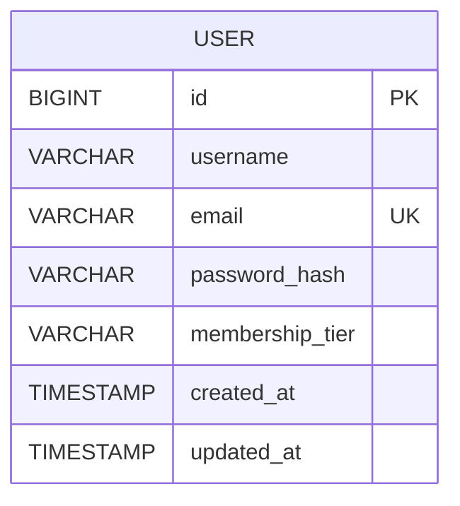

# Database Design — Phase 1

## 1. Purpose

This document describes the data storage design for Phase 1 of the rewards platform.

Phase 1 uses:

* PostgreSQL for persistent user account data.
* Redis for temporary authenticated session data.

## 2. PostgreSQL Data Model

### User Table

Table name:

```text
users
```

| Column          | Type         | Constraints      | Description                |
| --------------- | ------------ | ---------------- |----------------------------|
| id              | BIGSERIAL    | PRIMARY KEY      | Unique user identifier     |
| username        | VARCHAR(50)  | NOT NULL         | User display name          |
| email           | VARCHAR(255) | NOT NULL, UNIQUE | User email address         |
| password_hash   | VARCHAR(255) | NOT NULL         | Securely hashed password   |
| membership_tier | VARCHAR(20)  | NOT NULL         | Current membership tier    |
| created_at      | TIMESTAMP    | NOT NULL         | Account creation timestamp |
| updated_at      | TIMESTAMP    | NOT NULL         | Last update timestamp      |

### Membership Tier Values

The supported values are:

```text
REGULAR
PREMIUM
SUPREME
```

New users are assigned:

```text
REGULAR
```

by default.

At the application level, membership tier will initially be represented using a Java enum.

Example:

```java
public enum MembershipTier {
    REGULAR,
    PREMIUM,
    SUPREME
}
```

The enum value will be stored in PostgreSQL as a string.

## 3. Entity Relationship

Phase 1 contains only one persistent domain entity.



## 4. Constraints

The database must enforce the following rules:

* `id` uniquely identifies each user.
* `email` must be unique.
* `username` must not be null.
* `email` must not be null.
* `password_hash` must not be null.
* `membership_tier` must not be null.

Application validation will also validate username, email, and password before persistence.

## 5. Indexes

The following index is required:

```text
UNIQUE INDEX on users.email
```

The unique constraint on `email` provides both uniqueness enforcement and efficient lookup during registration and login.

Additional indexes are not required for Phase 1.

## 6. Password Storage

Plain-text passwords must never be stored.

During registration:

```text
Plain password
    ↓
PasswordEncoder
    ↓
Password hash
    ↓
users.password_hash
```

The stored hash is used by Spring Security during authentication.

The password hash must never be returned through an API response.

## 7. Redis Session Storage

Redis is used only for server-side session storage.

The browser stores a session identifier in an HTTP cookie:

```text
SESSION=<session-id>
```

Redis stores the corresponding authenticated session data.

Conceptually:

```text
Browser

SESSION=abc123
      |
      v
Redis

abc123
  → authenticated user/session information
  → session metadata
  → expiration information
```

The application does not manually create its own Redis session schema. Session persistence is managed through Spring Session.

## 8. Data Ownership

### PostgreSQL

PostgreSQL is the source of truth for:

* Username
* Email
* Password hash
* Membership tier
* Account timestamps

### Redis

Redis stores temporary data such as:

* Active authenticated sessions
* Session metadata
* Session expiration

Redis is not the source of truth for user account data.

If a Redis session expires or is deleted, the user's PostgreSQL account remains unchanged.

## 9. Data Lifecycle

### Registration

A new record is inserted into:

```text
users
```

### Login

The user record is read from PostgreSQL.

After successful authentication, a session is created in Redis.

### Profile Request

The authenticated session is loaded from Redis.

The current user's persistent profile information is retrieved from PostgreSQL.

### Logout

The authenticated session is invalidated and removed from Redis.

The PostgreSQL user record is not modified.
