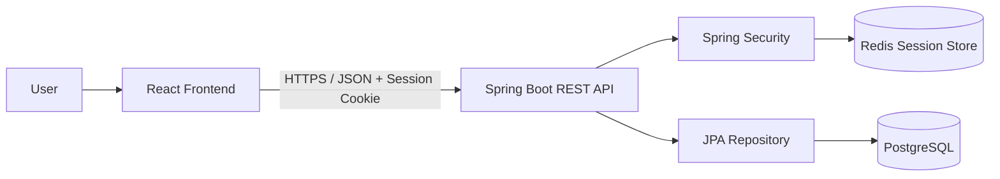
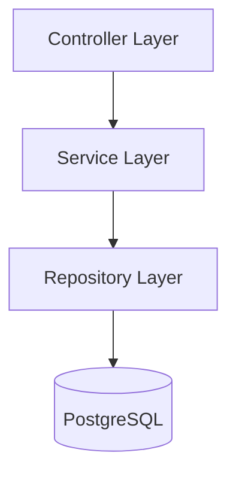
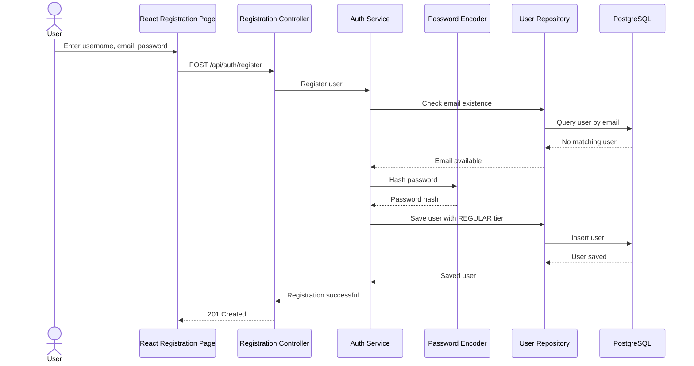
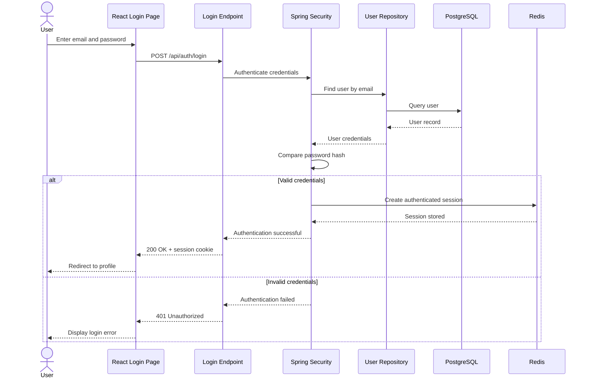
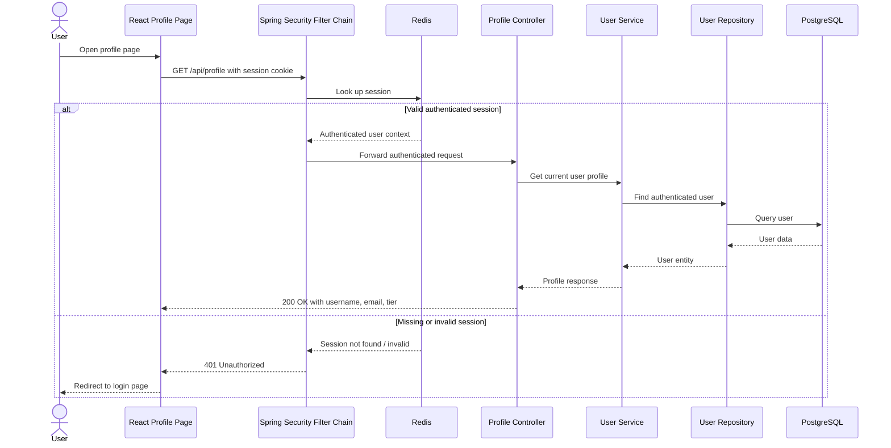
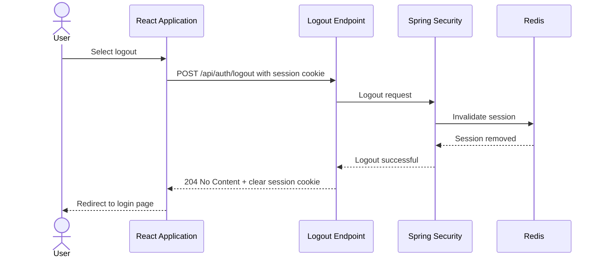

# System Design — Phase 1

## 1. Purpose

This document describes the high-level design for Phase 1 of the rewards platform.

Phase 1 supports:

* User registration
* User login
* User logout
* Authentication protection
* Viewing the authenticated user's profile
* Assigning the default `REGULAR` membership tier

Point management, products, shopping carts, and redemption are outside the scope of this phase.

## 2. Technology Stack

### Frontend

* React
* TypeScript
* Tailwind CSS

### Backend

* Java
* Spring Boot
* Spring Security
* Spring Data JPA

### Data Storage

* PostgreSQL - persistent user data
* Redis - server-side session storage

## 3. High-Level Architecture



The React frontend sends HTTP requests to the Spring Boot backend.

Spring Security authenticates protected requests before they reach the controller.

The backend uses Spring Data JPA repositories to read and write user data in PostgreSQL.

## 4. Backend Layering



### Controller layer

Responsible for:

* Receiving HTTP requests
* Validating request format
* Calling application services
* Returning HTTP responses

### Service layer

Responsible for:

* Registration logic
* Password hashing during registration
* Membership-tier assignment
* User-profile retrieval

### Repository layer

Responsible for:

* Finding users by email
* Checking whether an email already exists
* Saving user records
* Retrieving the authenticated user's profile data

Credential authentication and authenticated-session restoration are handled by Spring Security rather than by the application service layer.

## 5. Authentication Approach

The application will use server-side session authentication.

After a user successfully logs in, the backend creates an authenticated session.

The browser receives a session cookie containing the session identifier. The browser automatically sends this cookie with subsequent requests.

Session data is stored server-side in Redis.

PostgreSQL remains the source of truth for persistent user information such as username, email, password hash, and membership tier.

Redis stores temporary authenticated-session data. The browser stores only the session identifier in a cookie and does not store the user's authentication state directly.

The session cookie will be configured with appropriate security attributes:

* `HttpOnly` to prevent access from frontend JavaScript.
* `Secure` in production so that the cookie is only transmitted over HTTPS.
* An appropriate `SameSite` policy.
* A configured session expiration period.

The exact session timeout will be determined during implementation.

The authentication flow is:

User logs in
→ Spring Security validates credentials
→ Server creates authenticated session
→ Session is stored in Redis
→ Browser receives session cookie
→ Browser sends cookie with protected requests
→ Spring Security retrieves the session and restores authentication

## 6. Registration Flow



## 7. Login Flow



## 8. Profile Access Flow



## 9. Logout Flow



## 10. User Data Model

The Phase 1 user model contains:

```text
User
-------------------------
id
username
email
passwordHash
membershipTier
createdAt
updatedAt
```

The initial membership-tier values are:

```text
REGULAR
PREMIUM
SUPREME
```

All new users receive the `REGULAR` tier.

## 11. Security Rules

* Session identifiers must be securely generated and must not contain sensitive user data.
* Session cookies must use `HttpOnly`.
* Session cookies must use `Secure` in production.
* An appropriate `SameSite` cookie policy must be configured.
* Sessions must expire after a configured period.
* Logout must invalidate the server-side session stored in Redis.
* Password verification during login is handled using Spring Security and the configured password encoder.

Public endpoints:

```text
POST /api/auth/register
POST /api/auth/login
```

Protected endpoints:

```text
POST /api/auth/logout
GET /api/profile
```

Security requirements:

* Passwords must never be stored in plain text.
* Users must only retrieve their own profile.
* Protected endpoints must reject unauthenticated requests.
* Authentication cookies must not be accessible through frontend JavaScript.
* Error responses must not reveal whether sensitive account information exists unnecessarily.

## 12. Key Design Decisions

* Authentication will use server-side HTTP sessions managed by Spring Security.
* Redis will be used as the server-side session store.
* The browser will store only the session identifier in an HTTP cookie.
* Persistent user data will remain in PostgreSQL and will not be stored primarily in Redis.
* Credential authentication will be handled by Spring Security.

* Spring Data JPA will be used for standard user persistence.
* PostgreSQL will store user account data.
* Membership tier will initially be represented as an enum.
* New users always start in the `REGULAR` tier.
* Authentication and membership tiers are separate concerns.
* The profile endpoint identifies the user from the authenticated request rather than accepting a user ID from the frontend.
